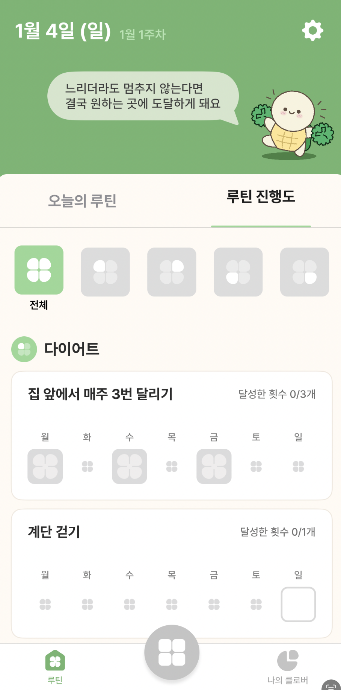

# Mandal-Art 앱 계획서 (수정본)

이 문서는 코드 작성 전에 합의해야 할 범위, 구조, 기술 선택, 릴리스 단계, 리스크를 정리한 계획서입니다.

## 0) 제품 맥락 및 철학
- 목적: 1년 단위 목표를 **5x5 변형 만다라트**로 관리
- 구조: **메인 1, 서브 4, 세부 20** (총 25셀)
- 종이 차트의 불편함(수정 어려움, 분실, 시각 한계) 해결
- 모바일 퍼스트, 웹(PWA 등) 지원
- 오프라인 퍼스트: 로컬 저장소/SQLite, MVP는 로그인 없음
- 장기 사용(1년)을 전제로 동기부여/성취감 강화
- 게임화는 MVP에 최소만, 향후 확장 가능해야 함

### ⚠️ 게이미피케이션 고려사항
만다라트는 **정적인 목표 관리 방식**:
- 목표는 한 번 완료되면 끝 (매일 반복 X)
- 며칠~몇 달에 걸쳐 완료하는 장기 목표
- 스트릭(연속 달성), 일일 XP 등 **습관 트래커 방식과 맞지 않음**

**RPG/게이미피케이션 적용 시 대안:**
1. **마일스톤 기반 보상**: 달성률 25%/50%/75%/100% 도달 시 뱃지
2. **만다라트 완료 보상**: 전체 완료 시 특별 이펙트/캐릭터 진화
3. **누적 성취**: 완료한 만다라트 개수에 따른 레벨업
4. **월간 리포트**: 이번 달 완료한 세부 목표 수 통계

→ "매일 뭔가 하기"가 아닌 "장기 목표 달성" 관점의 보상 설계 필요

## 1) 그리드 구조 (5x5 = 25셀)

### 레이아웃
```
     Col 0        Col 1        Col 2        Col 3        Col 4
   ┌───────────┬───────────┬───────────┬───────────┬───────────┐
R0 │ 서브1-세부  │ 서브1-세부  │ 서브1-세부   │ 서브2-세부  │ 서브2-세부  │
   │  idx: 0   │  idx: 1   │  idx: 2   │  idx: 3   │  idx: 4   │
   ├───────────┼───────────┼───────────┼───────────┼───────────┤
R1 │ 서브1-세부  │ [서브1]    │ 서브1-세부  │ [서브2]     │ 서브2-세부  │
   │  idx: 5   │  idx: 6   │  idx: 7   │  idx: 8   │  idx: 9   │
   ├───────────┼───────────┼───────────┼───────────┼───────────┤
R2 │ 서브3-세부  │ 서브3-세부  │ [메인]      │ 서브2-세부  │ 서브2-세부  │
   │  idx: 10  │  idx: 11  │  idx: 12  │  idx: 13  │  idx: 14  │
   ├───────────┼───────────┼───────────┼───────────┼───────────┤
R3 │ 서브3-세부  │ [서브3]    │ 서브4-세부  │ [서브4]     │ 서브4-세부  │
   │  idx: 15  │  idx: 16  │  idx: 17  │  idx: 18  │  idx: 19  │
   ├───────────┼───────────┼───────────┼───────────┼───────────┤
R4 │ 서브3-세부  │ 서브3-세부  │ 서브4-세부   │ 서브4-세부  │ 서브4-세부  │
   │  idx: 20  │  idx: 21  │  idx: 22  │  idx: 23  │  idx: 24  │
   └───────────┴───────────┴───────────┴───────────┴───────────┘
```

### 셀 역할 정의

| 역할 | Index | 위치 | 개수 | 설명 |
|------|-------|------|------|------|
| `main` | 12 | (2,2) | 1 | 메인 목표 - 중앙 |
| `sub` | 6, 8, 16, 18 | 대각선 | 4 | 서브 과제 - 핵심 영역 |
| `detail` | 나머지 | - | 20 | 세부 과제 |

### 영역별 세부 과제 매핑

```dart
// 서브 과제별 담당 세부 과제 인덱스
const Map<int, List<int>> subGoalDetailMapping = {
  6:  [0, 1, 2, 5, 7],      // 서브1 (좌상단) - 예: 건강
  8:  [3, 4, 9, 13, 14],    // 서브2 (우상단) - 예: 성장
  16: [10, 11, 15, 20, 21], // 서브3 (좌하단) - 예: 재테크
  18: [17, 19, 22, 23, 24], // 서브4 (우하단) - 예: 취미
};
```

### 예시 (이미지 기반)
```
"발전하는 에반" 만다라트:

┌───────────┬───────────┬───────────┬───────────┬───────────┐
│ 헬스장    │ 하루물2L  │ 일주일    │ 한달한권  │ 네트워킹  │
│ 주3회가기 │ 마시기    │ 2번산책   │ 이상독서  │ 모임참여  │
├───────────┼───────────┼───────────┼───────────┼───────────┤
│ 매일아침  │ [건강]    │ 12시전에  │ [성장]    │ 사이드    │
│ 스트레칭  │           │ 취침      │           │ 프로젝트  │
├───────────┼───────────┼───────────┼───────────┼───────────┤
│ 부수입    │ 적금      │ [발전하는 │ 하루1시간 │ 뉴스레터  │
│ 월50만원  │ 2천만원   │  예진]    │ 아티클    │ 읽기      │
├───────────┼───────────┼───────────┼───────────┼───────────┤
│ 고정지출  │ [재테크]  │ 등산10번  │ [취미]    │ 기타      │
│ 20만원↓  │           │           │           │ 배우기    │
├───────────┼───────────┼───────────┼───────────┼───────────┤
│ 배달음식  │ 주식수익  │ 마라톤    │ 필라테스  │ 베이킹    │
│ 월2회이하 │ 10%달성   │ 10km완주  │ 주1회     │ 클래스    │
└───────────┴───────────┴───────────┴───────────┴───────────┘

달성률: 40% (체크된 항목 8개 / 전체 20개)
기한: ~26년 12월 31일
```

## 2) 사용자 스토리 (MVP)
- 사용자는 기간별 만다라트(5x5)를 생성할 수 있다.
- 사용자는 셀을 탭해 목표 텍스트를 수정할 수 있다.
- 사용자는 각 셀의 상태를 TODO/DOING/DONE으로 설정할 수 있다.
- 사용자는 목표별 회고(메모)를 작성할 수 있다.
- 사용자는 자동 저장으로 데이터 유실 없이 사용할 수 있다.
- 사용자는 여러 개의 만다라트를 보유하고 전환할 수 있다.
- 사용자는 만다라트별 기간(종료일)을 설정할 수 있다.
- 사용자는 달성률(%)을 한눈에 확인할 수 있다.

## 3) 정보 구조(IA) 및 데이터 모델

### 내비게이션 구조
- 홈: 만다라트 목록 (카드 형태)
- 만다라트 상세: 5x5 그리드 뷰 + 헤더(이모지, 제목, 달성률, 기한)
- 목표 상세: 텍스트/상태/메모 편집 (다이얼로그)
- 설정: 기본 환경 설정(추후 내보내기 등 확장 여지)

### 데이터 모델

#### Mandalart 테이블
```dart
class MandalartEntity {
  String id;           // UUID
  String title;        // 만다라트 제목 (메인 목표)
  String? emoji;       // 대표 이모지 (예: 😎)
  DateTime? deadline;  // 목표 기한
  DateTime createdAt;
  DateTime updatedAt;
}
```

#### Goal 테이블
```dart
class GoalEntity {
  String id;           // "{mandalartId}:{gridIndex}"
  String mandalartId;  // FK
  int gridIndex;       // 0~24
  String goalText;     // 목표 텍스트
  int status;          // 0=todo, 1=doing, 2=done
  String? memo;        // 메모/회고
  DateTime createdAt;
  DateTime updatedAt;
}
```

### CellRole 계산 로직
```dart
enum CellRole { main, sub, detail }

CellRole roleForIndex(int index) {
  if (index == 12) return CellRole.main;
  if ([6, 8, 16, 18].contains(index)) return CellRole.sub;
  return CellRole.detail;
}

// 세부 과제가 속한 서브 과제 찾기
int? getParentSubIndex(int detailIndex) {
  for (final entry in subGoalDetailMapping.entries) {
    if (entry.value.contains(detailIndex)) {
      return entry.key;
    }
  }
  return null;
}
```

### 달성률 계산
```dart
// 세부 과제 20개 중 done 상태인 개수 / 20 * 100
double calculateProgress(List<GoalEntity> goals) {
  final detailGoals = goals.where((g) =>
    roleForIndex(g.gridIndex) == CellRole.detail
  );
  final doneCount = detailGoals.where((g) => g.status == 2).length;
  return doneCount / 20 * 100;
}
```

## 4) UI/UX 디자인

### 홈 화면 (만다라트 목록)
- 카드 리스트 형태
- 각 카드: 이모지 + 제목 + 달성률 바 + 기한
- 스와이프로 삭제
- FAB(+)로 새 만다라트 추가
- 롱프레스로 수정

### 만다라트 상세 화면
```
┌─────────────────────────────────────┐
│  만다라트                    + 추가  │
├─────────────────────────────────────┤
│              😎                      │
│         발전하는 예진           ⋮    │
│    달성률 (40%)  |  ~24년 12월 31일  │
│    ████████░░░░░░░░░░░░             │
├─────────────────────────────────────┤
│ ┌─────┬─────┬─────┬─────┬─────┐    │
│ │     │     │     │     │     │    │
│ ├─────┼─────┼─────┼─────┼─────┤    │
│ │     │ 서브│     │ 서브│     │    │
│ ├─────┼─────┼─────┼─────┼─────┤    │
│ │     │     │메인 │     │     │    │
│ ├─────┼─────┼─────┼─────┼─────┤    │
│ │     │ 서브│     │ 서브│     │    │
│ ├─────┼─────┼─────┼─────┼─────┤    │
│ │     │     │     │     │     │    │
│ └─────┴─────┴─────┴─────┴─────┘    │
├─────────────────────────────────────┤
│           [🔗 공유하기]              │
└─────────────────────────────────────┘
```

### 셀 디자인

| 역할 | 배경색 | 폰트 | 특징 |
|------|-------|------|------|
| `main` | 진한 배경 (#1a1a2e) | Bold, 큰 사이즈 | 중앙 강조, 흰색 텍스트 |
| `sub` | 초록색 (#4ade80) | Semi-bold | 카테고리 역할, 검정 텍스트 |
| `detail` | 흰색/연한 회색 | Regular | 체크 표시 가능 |

### 상태별 표시
- `todo` (0): 기본 배경
- `doing` (1): 노란색/주황색 테두리
- `done` (2): 체크마크(✓) 표시 + 회색 배경

## 5) 기술 스택

### 공통
- **Framework**: Flutter (Dart)
- **Database**: SQLite + Drift
- **State Management**: StreamBuilder (reactive)
- **Architecture**: Repository Pattern

### 플랫폼별
- iOS/Android: Flutter + SQLite
- Web(PWA): Flutter Web + Drift (IndexedDB)

## 6) 릴리스 플랜

### Release 1: Core MVP (현재 진행)
#### 사용자 스토리
- 사용자는 만다라트를 만들고 목록에서 전환할 수 있다.
- 사용자는 5x5 셀을 탭해 목표를 입력/수정할 수 있다.
- 사용자는 상태(TODO/DOING/DONE)를 변경해 진행을 표시할 수 있다.
- 사용자는 목표별 회고를 기록할 수 있다.
- 사용자는 앱을 재실행해도 데이터가 보존된 상태로 이어서 사용할 수 있다.

#### TODO
- [x] 프로젝트 구조/아키텍처 세팅
- [x] 만다라트 목록 화면
- [x] 만다라트 생성/수정/삭제
- [x] 그리드 렌더링 (현재 9x9)
- [x] 셀 편집 플로우
- [x] 상태 전환 UI 및 색상 규칙
- [x] 로컬 DB 스키마
- [x] 목표별 메모 저장
- [x] **9x9 → 5x5 그리드 구조 변경**
- [x] **CellRole 로직 수정 (main/sub/detail)**
- [x] **영역별 세부 과제 매핑 구현**
- [x] **달성률 계산 및 표시**
- [x] **UI 디자인 개선 (이미지 참고)**
- [x] **마지막 선택 만다라트 자동 로드**
- [x] **4개 서브 영역 시각적 구분 (독립 배치, 균일 베젤)**

### Release 2: UX & 시각화 ✅
#### TODO
- [x] 이미지 선택 기능 → 이모지 선택 기능으로 구현
- [x] 상태 변화 시 애니메이션

### Release 3: 공유 & 추가 기능
#### TODO
- [x] 공유하기 (이미지로 내보내기)
- [ ] 다크/라이트 테마
- [x] 템플릿 기능 (건강, 공부, 재테크, 취미 등 미리 정의된 만다라트)
- [ ] 알림/리마인더
- [ ] 완료 시 축하 애니메이션

### Release 4: 온보딩 & 튜토리얼
#### 사용자 스토리
- 첫 접속 사용자는 만다라트가 무엇인지 이해할 수 있다.
- 첫 접속 사용자는 앱 사용법을 단계별로 학습할 수 있다.
- 사용자는 튜토리얼을 스킵하거나 나중에 다시 볼 수 있다.

#### TODO
- [ ] 첫 접속 여부 판단 (SharedPreferences)
- [ ] 온보딩 화면 (만다라트 소개)
  - 만다라트란?
  - 5x5 구조 설명 (메인 1, 서브 4, 세부 20)
  - 목표 설정 방법
- [ ] 인터랙티브 튜토리얼
  - 첫 만다라트 생성 가이드
  - 셀 탭/롱프레스 안내
  - 상태 변경 방법 안내
- [ ] 튜토리얼 스킵 버튼
- [ ] 설정에서 튜토리얼 다시 보기 옵션

### Release 5: 루틴화 & 데일리 투두
#### 컨셉
만다라트의 세부 목표를 **루틴(반복 할 일)**으로 전환하여 매일 체크할 수 있게 함.
기존 일회성 완료 방식과 병행하여, 사용자가 목표 성격에 맞게 선택.

#### 목표 유형
| 유형 | 예시 | 완료 방식 |
|------|------|----------|
| 일회성 | 자격증 취득, 마라톤 완주 | 직접 "완료" 체크 |
| 루틴형 | 운동 주3회, 물 2L 마시기 | 투두 체크 누적 → 달성률 |

#### 루틴 설정
- 반복 주기: 매일 / 주N회 / 특정 요일
- 목표 기간 내 총 횟수 자동 계산
- 예: "운동 주3회" + 3개월 = 총 36회 목표

#### 달성률 계산
```
루틴 달성률 = (체크한 횟수 / 목표 횟수) × 100%
전체 달성률 = (완료된 일회성 + 루틴 달성률 평균) / 전체 목표
```

#### 사용자 스토리
- 사용자는 세부 목표를 "루틴"으로 설정할 수 있다.
- 사용자는 오늘의 할 일 목록에서 루틴을 체크할 수 있다.
- 사용자는 주간/월간 루틴 달성률을 확인할 수 있다.
- 사용자는 "평균보다 낮아요" 같은 인사이트를 받을 수 있다.
- 사용자는 루틴 알림을 받을 수 있다.

#### TODO
- [ ] 목표 유형 선택 UI (일회성 vs 루틴)
- [ ] 루틴 설정 (주기, 요일, 횟수)
- [ ] 오늘의 할 일 화면
- [ ] 루틴 체크 기능 + 히스토리 저장
- [ ] 달성률 계산 로직 (루틴 포함)
- [ ] 주간/월간 통계 화면
- [ ] 인사이트 ("평균보다 N% 낮아요", "3일 연속 달성!")
- [ ] 루틴 알림 (로컬 푸시)
- [ ] 위젯에서 오늘의 할 일 확인 (선택)
- [ ] 목표의 루틴화를 위해 목표 관리 UI/UX 추가 하단 이미지 참고
  
- [ ] 목표 추가 시 아래와 같이 어디서, 무엇을, 얼마나 체크 기능 추가 
  

### Release 6: Gamification (확장)
#### 고려사항
만다라트는 정적 목표 관리 방식이므로, 습관 트래커 스타일(스트릭, 일일 XP)은 적합하지 않음.
**장기 목표 달성** 관점의 보상 설계 필요 → 섹션 0) 참고

#### TODO
- [ ] 마일스톤 뱃지 (달성률 25%/50%/75%/100%)
- [ ] 만다라트 완료 이펙트/축하 애니메이션
- [ ] 누적 성취 레벨 시스템 (완료한 만다라트 개수 기반)
- [ ] 월간/연간 리포트 (완료한 세부 목표 수 통계)
- [ ] LLM 기반 RPG 캐릭터 성장 연계 (장기 검토)

### Release 7: 커뮤니티 & 소셜
#### 사용자 스토리
- 사용자는 자신의 만다라트를 커뮤니티에 공유할 수 있다.
- 사용자는 다른 사람의 만다라트를 구경하고 영감을 받을 수 있다.
- 사용자는 다른 사람의 만다라트에 좋아요(따봉)를 누를 수 있다.
- 사용자는 다른 사람의 만다라트에 응원 댓글을 남길 수 있다.
- 사용자는 인기 만다라트/최신 만다라트를 탐색할 수 있다.

#### 기술 요구사항
- **백엔드**: Firebase / Supabase / 자체 서버
- **인증**: 소셜 로그인 (Google, Apple, Kakao)
- **데이터베이스**: 클라우드 DB (Firestore 등)
- **스토리지**: 만다라트 이미지/썸네일 저장

#### TODO
- [ ] 사용자 인증 (회원가입/로그인)
- [ ] 프로필 설정 (닉네임, 프로필 이미지)
- [ ] 만다라트 공개/비공개 설정
- [ ] 커뮤니티 피드 (최신순/인기순)
- [ ] 좋아요(따봉) 기능
- [ ] 댓글/응원 기능
- [ ] 신고/차단 기능
- [ ] 다른 사람 만다라트 "템플릿으로 사용" 기능
- [ ] 팔로우/팔로잉 (선택)

## 7) 현재 상태 vs 목표

### 현재 구현됨 (5x5 기반) ✅
- ✅ 5x5 그리드 렌더링 (GridView crossAxisCount: 5)
- ✅ 기본 CRUD
- ✅ 상태 관리 (todo/doing/done)
- ✅ 로컬 DB 저장
- ✅ 메모 기능
- ✅ CellRole 로직 (main/sub/detail)
- ✅ 영역 매핑 로직 (서브-세부 매핑)
- ✅ grid_index 범위 (0~24)
- ✅ UI 디자인 (이미지 참고)
- ✅ 달성률 계산 로직 및 표시
- ✅ 마지막 선택 만다라트 자동 로드

### 프로젝트 구조
```
lib/
├── app/
│   └── app.dart                    # 앱 진입점
├── core/
│   ├── constants/
│   │   ├── app_colors.dart         # 컬러 팔레트
│   │   └── grid_constants.dart     # 5x5 그리드 상수/유틸리티
│   ├── models/
│   │   └── goal.dart               # Goal 모델 + GoalStatus
│   ├── services/
│   │   └── preferences_service.dart # 앱 설정 (마지막 만다라트 등)
│   └── theme/
│       └── app_theme.dart          # Material 3 테마
├── data/
│   ├── db/
│   │   ├── app_database.dart       # Drift DB 스키마
│   │   └── app_database.g.dart     # 생성된 코드
│   ├── goal_repository.dart
│   └── mandalart_repository.dart
├── features/
│   ├── home/
│   │   ├── home_screen.dart        # 홈 화면
│   │   └── widgets/
│   │       ├── create_mandalart_sheet.dart
│   │       └── mandalart_card.dart
│   ├── mandalart/
│   │   ├── mandalart.dart          # Mandalart 모델
│   │   ├── mandalart_detail_screen.dart
│   │   └── widgets/
│   │       ├── goal_edit_sheet.dart
│   │       ├── mandalart_cell.dart
│   │       ├── mandalart_grid.dart
│   │       └── mandalart_header.dart
│   └── startup/
│       └── startup_screen.dart     # 시작 화면 (마지막 만다라트 로드)
└── main.dart
```

## 8) 리스크 및 대응

### Release 1 리스크
- **데이터 마이그레이션**: 기존 9x9 데이터가 있다면 5x5로 변환 필요
  - 대응: 새 DB 스키마 버전으로 마이그레이션, 또는 기존 데이터 삭제
- **영역 매핑 오류**: 세부 과제가 잘못된 서브에 연결될 수 있음
  - 대응: 매핑 테이블 단위 테스트

### 기술 리스크
- 웹(IndexedDB) 안정성: 브라우저별 차이 검증 필요
- 로그인 부재: 기기 변경 시 데이터 이관 전략 필요

## 9) 확인 완료된 사항
- ✅ **5x5 구조 확정** (9x9 아님)
- ✅ **메인 1 + 서브 4 + 세부 20 구조**
- ✅ Flutter 스택 사용
- ✅ MVP에서 내보내기(이미지/PDF)는 제외 (R3에서 구현)
